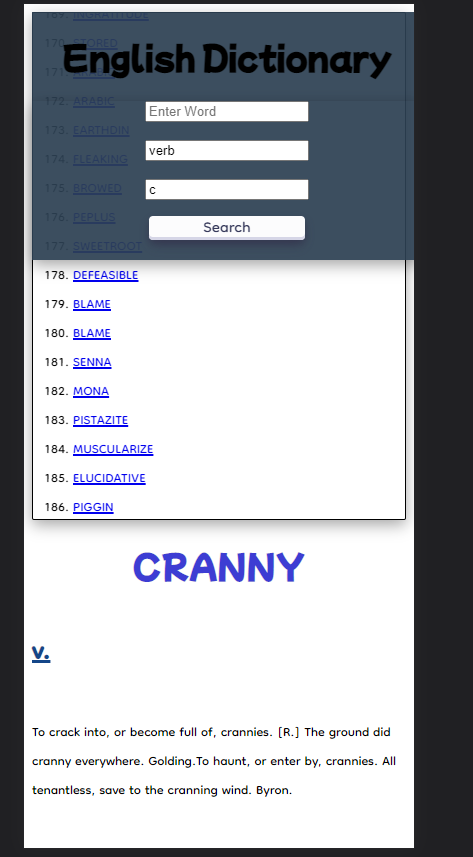

# A repo for English-Dictionary front side
### url to repo s3 bucket :
- https://english-dictionary-dynamo.s3.eu-south-1.amazonaws.com/index.html
or 
-  https://s3.console.aws.amazon.com/s3/buckets/english-dictionary-dynamo?region=eu-south-1&tab=objects

## scenario
### clicking on a word

### searching a specific word 

### searching a random word with a specific noun (with or without letter)
